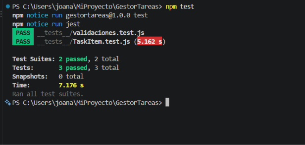

# Gestor de Tareas

Aplicación móvil desarrollada con React Native y Expo como trabajo práctico de Aplicaciones Móviles.

## Opción elegida

Gestor de Tareas.

La aplicación permite registrar un usuario, iniciar sesión y administrar una lista de tareas de manera local.

## Funcionalidades implementadas

- Registro de usuario con usuario y contraseña.
- Inicio de sesión con validación de los datos guardados.
- Navegación entre pantallas mediante React Navigation.
- Creación de nuevas tareas.
- Registro de un horario de recordatorio para cada tarea.
- Visualización de las tareas y sus recordatorios.
- Eliminación de tareas.
- Persistencia de usuarios y tareas mediante AsyncStorage.
- Componente reutilizable `TaskItem` para mostrar las tareas.
- Validación de datos.
- Pruebas automatizadas con Jest y React Native Testing Library.

## Pantallas de la aplicación

La aplicación cuenta con las siguientes pantallas:

- Login.
- Registro.
- Mis Tareas.
- Nueva Tarea.

## Tecnologías utilizadas

- React Native.
- Expo.
- React Navigation.
- AsyncStorage.
- Jest.
- React Native Testing Library.

## Instalación

Para instalar las dependencias del proyecto:

```bash
npm install
```

## Ejecución

Para iniciar la aplicación:

```bash
npx expo start
```

La aplicación puede abrirse desde un dispositivo móvil utilizando Expo Go.

## Testing

La aplicación cuenta con 3 pruebas automatizadas realizadas con Jest y React Native Testing Library.

- Se verifica que el componente reutilizable `TaskItem` muestre correctamente el nombre de una tarea.
- Se verifica que al presionar el botón `ELIMINAR` se ejecute la función correspondiente.
- Se verifica la validación del nombre de una tarea mediante la función `validarTarea`.

Para ejecutar los tests:

```bash
npm test
```

Resultado obtenido:

```text
Test Suites: 2 passed, 2 total
Tests:       3 passed, 3 total
```

### Captura de los tests



## Video demostrativo

Enlace al video de demostración en YouTube:

Pendiente de agregar.

## Autor

Joana Marinelli